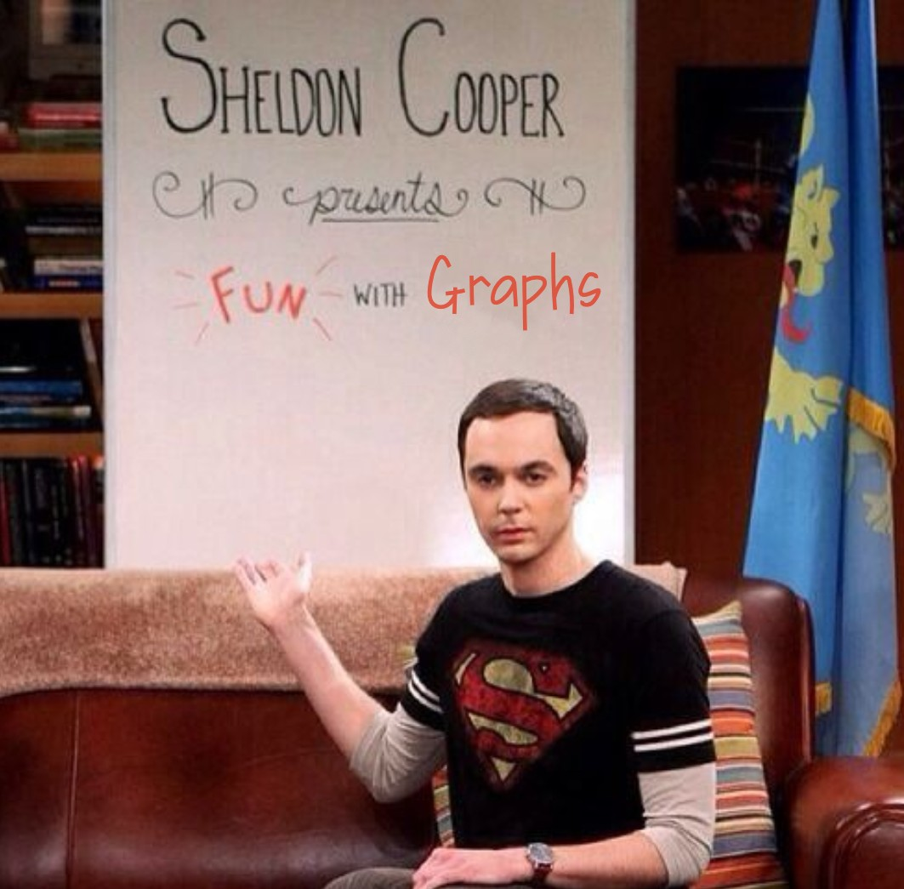

# Fun With Graphs
Custom `Graph Animations With Python`



# Base
Fun with Graphs has a base file called "graph.py" that allows you to animate some basic behaviors:

- Adding a node
- Adding an edge
- Adding a node for a complete graph (with all needed edges)
- Changing the color of a node
- Removing a node 
- Waiting for a certain amount of time

Most of these behaviors are not fool proof: they don't consider all possible edge cases. This is because the main goal of this project is to provide a simple way to animate graphs, not to provide a full-fledged graph library.

# Usage
You can use the `execute_commands` method to execute a list of commands. 
This are some examples of available commands for `Graph`:

```py
# Add a new node to the graph
new <node_id>

# Connect two nodes with an edge
connect <node1> <node2>

# Color one node
color <node_id> <color>
# Color all nodes
color all <color>
# Color all nodes but one
color all-<node_id> <color>

# Wait for a certain amount of time (seconds)
sleep <seconds>

# Remove a node
kill <node_id>
```

Despite the fact that the `Graph` class has limited behavior, it can be easily used to create more complex ones. For example, this project includes a file called "raft.py", that re-creates the behavior of the `Raft consensus algorithm`, using the methods provided by `Graph`.


## Raft.py

In this file, some methods of the class `Graph` were grouped into new methods of a class called `Raft`.

This file includes the following behaviors:

- Adding a node
- Starting an election
- Killing a node
- Killing the leader of the cluster

In addition to the `execute_commands` method, the `Raft` class has a new `execute_random` method that executes a random sequence of commands. This method is used to simulate the behavior of a cluster of nodes in the Raft algorithm.

You can create your own classes that group the behaviors of the `Graph` class into more complex ones, even modifying the `Graph` class itself.

# Running the code
To run the code, you need to have Python 3 installed, with all the libraries used in this project:

- networkx
- matplotlib

You can easily run the code by calling `Python3` and passing the name of the file you want to run. For example:

```sh
python3 raft.py
```

A Log will be printed to the console, showing the commands that are being executed. The graph will be displayed in a window, showing the current state of the graph.\\
Once the commands are finished, the window will close automatically.


<video width="450" height="450" controls>
  <source src="raft_animation.mp4" type="video/mp4">
</video>